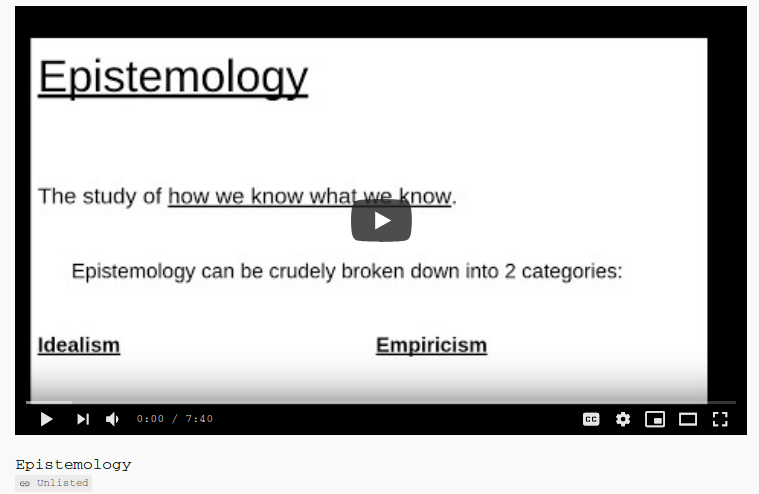
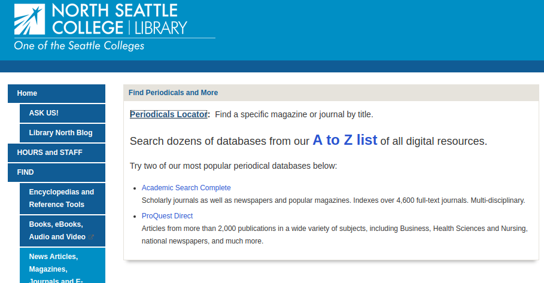

```{r setup, include=FALSE}
knitr::opts_chunk$set(echo = TRUE)
```

# Getting started {#getStart} 

## Course Layout

Read/watch some things, write some things.  You will save these written bits of work somewhere that can be shared. Google docs is probably the easiest.  Microsoft onedrive is another. 

### ungrading and self reflections

Rubrics and point chasing are harmful.  Or at worst they don't foster good thinking and education.  I am realizing that using them reduce anxiety in me, the instructor, because I don't have to actually consider the student.  

An overview video on self reflection.  This is not a detailed set of instructions but a gentle intro. [self refleciton overveiw](https://youtu.be/rsH09jsGVSk){target='_blank'}


### Grades 

Grades will be based on your own assessment of what you've earned. You are giving yourself a grade. I have the right to overrule your assessment, but I anticipate people are going to be fair to themselves to this class. Feedback will be given to many of your weekly writings. However I do not promise to give feedback to all papers every week.

I intend to provide my own writing each week and my own reflection for you to witness. If I do give you feedback on a weekly writing, my intention for it is to push gently for you to consider deeper issues that is aligned with your wants for the class. If I give you feedback on a weekly assignment, the feedback will be embedded in your document. This is why I have asked you to allow anyone with the link to edit.  My hope is to just put comments right into your doc.

At least twice this quarter I will ask you to provide me a short sample of your writing from the previous weeks and a self-reflection on your progress. I will read all of these and give feedback on all of them.

The reason you're writing every week is to provide yourself a track record of writings from which you can reflect upon. If you do not do this, you won't have enough papers to reflect upon.

###  Communication

#### Canvas will be used lightly.

First week discussions and introductions, a place to find this schedule, and a way for me to quickly send announcements.

#### Please don't use Canvas as email

#### Use discussion boards in slack

First of all, you may have some questions about Slack.

It's basically a social media platform where you can participate in teams by having threaded chats or sharing of documents.It can be used synchronous synchronously or asynchronously.

The main reason I'm using it is simply that canvas does not have the same capabilities. It also requires a lot more work for me as the teacher to manage. Slack appears to be a little bit easier in that respect. 

Secondly, you may want to know how to sign up for our slack Channel.  [You will need to use this invitation:](https://join.slack.com/t/generalpsychology-hq/shared_invite/zt-hw53cjb8-Gu_GEolsoQNq2U7Q2CTvGg) (Links to an external site.)

A very important part about signing up for slack is that you need to use the email that you used to sign up for classes at North Seattle. The reason is that this will be a relatively easy way for me to make sure that the students enrolled in the class are able to access our slack Channel, and that random people cannot.

Once you have signed up for slack, spend some time filling out your profile make sure to make your profile picture and actual picture of you. And I believe every time from then on should you sign into slack, you'll see our abnormal psychology Channel.
 
The last thing about slack is that when it comes to sharing documents, you may need to add permissions for slack to interact with your word processing program. For instance I use Google Docs a lot and I have already added Google Docs as an app that is recognized by Slack.  Let me know which word processing program you use oh, it has to be a cloud-based, and I think I can add that to slack.  So far I've added Google Docs and Microsoft onedrive (both, I believe are free to use by North Seattle students.)

#### Tips for using Slack

[Slack tips, will need to sign in to canvas for this video](https://northseattle.hosted.panopto.com/Panopto/Pages/Viewer.aspx?id=ba5dc535-de92-40c7-9460-ac5301350a62){target='_blank'}

#### Adding yourself to a hidden slack channel

In Fall 2020, slack had a bug preventing the instructor from adding everyone to a channel with a single click.  This mean each person had to be added individually, which is very time consuming.  [This is a simple list of instructdions with pictures showing how to search then add yourself to a channel.](https://docs.google.com/document/d/1nH12L-FIFA2aXSMViuSt73WbAR9Fr78bQD0lpYTQLmg/edit?usp=sharing"){target='_blank'} 

## Access to OneDrive and email for students

I'm a fan of gmail and google drive, but as a fee-paying student in the Seattle Colleges District, you have been giving a free account with Microsoft oneDrive.  oneDrive is an online office suite that has web-based versions for email, word processing, spreadsheets, PowerPoints.  [here is where to go to set that up](https://itservices.seattlecolleges.edu/myseattlecolleges-login){target=’_blank’}

When you write a paper, you can write it directly into the word application in OneDrive, or you could write your paper on your home computer, and then as necessary upload into oneDrive.  

### Videos:  How to Log into and using oneDrive, Gmail

#### [Video how to log in to OneDrive--stored in canvas](https://northseattle.hosted.panopto.com/Panopto/Pages/Viewer.aspx?id=f92016e6-6dc6-4daa-a90c-ac4d013607a6){target='_blank'}

#### [Video how to generate a sharable link in OneDrive--stored in canvas](https://northseattle.hosted.panopto.com/Panopto/Pages/Viewer.aspx?id=f35b3b7d-331a-46e5-b308-ac4d013607e8){target='_blank'}

```{block, type='blueBackground'}
Please note that if you change the sharing settings, I think Microsoft creates a new URL that must be posted in our learning environment (slack, canvas, etc).  Again.  So, after you have set your sharing settings, copy the link and share it.   
```

#### [How to share a google drive doc -- stored in canvas](https://northseattle.hosted.panopto.com/Panopto/Pages/Viewer.aspx?id=0f8a111c-0346-4935-b556-ac4d013fed06){target='_blank'}

#### [How to see google drive revisions -- stored in canvas](https://northseattle.hosted.panopto.com/Panopto/Pages/Viewer.aspx?id=2c3fcd6a-0ee9-4c97-9b71-ac4d013fed6b){target='_blank'}

# Week 1 {#Week1} 

## What do you want to focus on
Think about what you want to learn:

Some topics in the past that I have taught include the following and you may find them useful starting points to think about your own process for this quarter.

1. Critical thinking
2. Technical writing new paragraph finding published research
3. Evaluating the quality of published articles, for example contrasting popular sources from academic or scholarly.
4. General introduction to the content of psychology
5. Theories within psychology
6. Criticisms of psychology
7. Limits of psychology
8. Philosophy of science
9. Working within groups
10. Psychology as it relates to other disciplines

### recent additions

11. Power structures
12. How to have inclusive group meetings
    * what are good ground rules for meetings

Any and all of these above could qualify.
The goal here is for us to collectively think of it about what you'd like to learn in our time together.

This list is not exhaustive. There's some things that you may want to focus on or add. Perhaps this might include cognitive dissonance about being a white person and being told that you've got white privilege. What are some ways one can think about opening up to that feedback?

Although I have some expert content knowledge in psychology, it's not exhaustive. I don't know everything, I have my own biases and that there may be things you'd like to learn about and practice and I would be open to hearing those things as well as how to incorporate it into the overall class. 

## Do Some reading


1. [The syllabus](https://docs.google.com/document/d/1Jwo68U8f3gWTWgu_EuTNyGQD2KQeQROsqP_BauADs1g/)

2. [Miller's law of communication (in the syllabus)](https://docs.google.com/document/d/1Jwo68U8f3gWTWgu_EuTNyGQD2KQeQROsqP_BauADs1g/edit#heading=h.exo9wouxy9qk)

3. [George Orwell, Politics and the English Language, 1946 (in the syllabus)](https://docs.google.com/document/d/1Jwo68U8f3gWTWgu_EuTNyGQD2KQeQROsqP_BauADs1g/edit#heading=h.f3hxyeh73uh7)

4. [The 9 standards of Critical thinking (in the syllabus)](https://docs.google.com/document/d/1Jwo68U8f3gWTWgu_EuTNyGQD2KQeQROsqP_BauADs1g/edit#heading=h.j2nlxy74qee8)

5. [Textbook, chapter 1: What is Psychology?](https://openstax.org/books/psychology-2e/pages/1-introduction)

6. Dictionary/Wikipedia definitions on: 

      *Anthropomorphize
 
      *Ethnocentrism

7. watch intro lecture on epistemology

[{width="40%"}](https://youtu.be/L6fcTl_js5g "Epistemology")

8. Read about "stereotype threat".  Not stereotypes.  There is a difference.  You'll need to find a source or two on your own.  


## Do the following

1. Introduce yourself in the Canvas Introductions discussion board

2. Write something about what interests you about psychology

3. Write a post responding to the following prompts

    what is your process for thinking clearly?

    How do you know something is true?

7. Share your ideas about what you want to learn in the Canvas small group discussion


## Your work is reading and writing.  

We will use slack to share a lot of our work. This first week we'll have 1 discussion group in canvas but I'd like to move on to slack for week 2 and beyond. 

I'll share/publish those soon. You may find that using [Google Docs](http://drive.google.com) is a very good cloud-based place to store your writing.

There are other places for you to do this. Microsoft oneDrive, Dropbox, I would just recommend to not simply save them on your computer in the event that some crash happens.

But for now, you can at least begin reading, watching, and writing.  

# Week 2 {#Week2} 

## Orienting comment

If you're relatively new to taking college classes, you might find it disconcerting that we don't simply have you remember a list of vocabulary words. Sometimes that's appropriate. In psychology, as an example coming the term "negative reinforcement" is often confused with a form of punishment.

But this is relatively a shallow level of knowledge. Check out this simple hierarchy pertaining to thinking: [Bloom's taxonomy ](https://uwaterloo.ca/centre-for-teaching-excellence/teaching-resources/teaching-tips/planning-courses-and-assignments/course-design/blooms-taxonomy)

Vocabulary is a very low level type oejof knowledge. And so what are the reasons that human beings create schools and classes such as this is to understand things in a deeper way or in a more complicated Way.

So you may be interested to know in Psychology, what causes attention deficit hyperactivity disorder. You might wonder what causes bipolar disorder or why is it that you  enjoy one type of activity but somebody else does not. Or perhaps how it is that certain romantic partners get along while others do not. These are all interesting questions and Curiosities.

The moment you start getting into those questions, it would be nice if there were short answers but those short answers are usually simplistic and shallow.

So we have to practice, and it is a practice – you don't just get an education and stop learning--you have to keep practicing what you know and how you know it.  And it turns out that is a philosophical question.

So, week 2 is going to be a lot to do with philosophy. It overlaps a little bit with the materials you watched during week one. But the idea is that you're going to have to reflect a little bit about this epistemological question: how do you know what you know


## Read Some stuff

1. Re-read the critical thinking items in the syllabus

2. Read [Chapter 2 of your textbook](https://openstax.org/books/psychology-2e/pages/2-introduction){target="_blank"}

3. Read @Schwartz1771, [The importance of stupidity in scientific research
](https://jcs.biologists.org/content/121/11/1771){target='_blank'}

## Do the following

1. write a synthesis of the 3 sources above.  You may want to consider comment about whether you think knowledge is static. 
2. Save your work so that 'everyone with the link' can view it, on cloud based source. 

3. Share your work on slack by linking to it in the slack channel # week 2 synthesis on science

4. Read and comment upon some of your classmates submissions.  If you hover over their post, you should see a floating menu with the option to reply in a thread on the side. 

## Added materials

* [Lecture on one way to write a synthesis paper--This should pop-up a new tab/window but you'll have to log in to canvas because that is how the videos are stored.](https://northseattle.hosted.panopto.com/Panopto/Pages/Viewer.aspx?id=44737fc2-c8cb-4286-9dcf-ac4b011de256){target='_blank'}

* [Quick 6 min intro on critical thinking](https://www.youtube.com/watch?v=3CkLAMLTkmI&feature=youtu.be){target='_blank'}


# Week 3   {#Week3} 

## It's a pretty dense unit.  

## Do, Watch, and Read the following

A. Make a note of how much you think you understand about biological influences of psychology. For example, you might simply "I understand 20% of biological influences on our lives".

B. Pick a behavior--a feeling, an action, a thought, but try to keep it simple (In fact thoughts may be too hard) and write a few sentences that explains how biologically it happens. **Do this before watching/reading below**

C. [Layers of Psychological explanation--10 min](http://faculty.seattlecolleges.edu/faculty/brian.holt/vids/Fall2019General/The_systems.mp4){target='_blank'}

D. [Biopsych youtube playlist, 10 videos of various lengths](https://www.youtube.com/playlist?list=PLDEwZwMNQswtFvhRvOliHzeDfuBPIdsSf){target='_blank'}


E. Read [Chapter 3 of your textbook](https://openstax.org/books/psychology-2e/pages/3-introduction){target="_blank"}

## Do the following

1. Reassess your understanding from above A.
2. What would you add to your understand in B.
3. Whether or not the textbook and videos didn't lead to any new learning, identify what you would like to know more about.  What is still missing for you?
4. Link your writing for #3 to the Channel #More_Biopsych
5. Read some other posts from classmates and find some areas of interest and then list some new sources of information.


# Week 4  Oct 19 {#Week4} 

## Do, Watch, and Read the following

A. Like last week, Pick a behavior--a feeling, an action, a thought, but try to keep it simple (thoughts may work here) and write a few sentences that explains how the environment causes the behavior. Said another way, explain what is happening in the environment to elicit the behavior.  For clarification, you could say last week the biology is **how** the behavior works while this week you are explaining **when** it works. **Do this before watching/reading below**

    As an example, consider driving a car down a street and you hit the brakes.  The behavior is the stepping on the brake.  What environmental stimulus 'caused' the stepping on the brake 

B. Read [Chapter 6 of your textbook](https://openstax.org/books/psychology-2e/pages/6-introduction){target="_blank"}

C. [Learning theories youtube playlist, videos 1: 2](https://www.youtube.com/playlist?list=PLDEwZwMNQswsCPfmo03BZBkLURdfDubMX){target='_blank'}

D. [Video on the law of effect](https://www.youtube.com/watch?v=fanm--WyQJo){target='_blank'}

E. [Remaining Learning theories youtube playlist](https://www.youtube.com/playlist?list=PLDEwZwMNQswsCPfmo03BZBkLURdfDubMX){target='_blank'}

F. @Naik_2001 [Behaviorism as a theory of personality](http://personalityresearch.org/papers/naik.html){target='_blank'}  


## Do the following

1. Reassess your understanding from above A.
2. Is your chosen behavior better explained by classical conditioning or operant conditioning?  What key feature led you to this choice?
3. Whether or not the textbook and videos didn't lead to any new learning, identify what you would like to know more about.  What is still missing for you?
4. Choose a new behavior that you want to change its frequency.  Like eating more chocolate.  I mean less.  Less chocolate.  How might you change the **environment** so that you eat ~~more, damn~~ I mean less chocolate?
5. Link your writing for #3 and #4 to the Channel #Learning-theory
6. Comment and try to engage with a few of your classmates on this assignment.

# Week 5 Oct 26  {#Week5} 

## New layer of explanation: Cognition background

So this week throws us into the deep end of the pool regarding the way that we think about the world.

Ever since human beings have been writing and probably painting on the inside of caves there has been some quality of activity that we would recognize as “thinking.”

In the 60s when computers began to displace workers in the workplace, collectively across the planet people began to recognize that in some ways human beings have a cognitive ability that might be modeled as a computer. In other words, during the fifties and sixties, Humanity received a new lexicon for describing things like memory, thinking, processing information. 

Our contemporary understanding of long-term memory is *because* we first had a computer part called a hard drive. I'm oversimplifying it a bit, but what I want to impress upon you is that a lot of the concepts that we use to describe thinking came about because we invented computers. Once we had a lexicon about computers we began to use that lexicon to describe humans. It's not a perfect model, but it's taught us a lot about the limits of our cognitive powers.

## Instructions

To begin, and before you start doing more reading, I want you to First Imagine some scenario. I am only asking you think of 1. 
While you do this imagine that you are able to witness your thoughts from the point of view of  another person, or perhaps a different side of yourself. It might be that you are watching your behavior and the pattern of how your thoughts come about, it might be an auditory exercise where you're able to listen to the words you're saying.  Most of you do this naturally, but some of you might not have a lot of experience in observing your own thoughts.

## Do the following (Part A)

* Think about why you might not ask somebody out on a date?  A lot of the first thoughts that come to your mind will be relatively broad and vague. A good example of this is going to be a fear of rejection. If you think about this particular example, try to think about a specific person that you do not want to ask out on a date, and think about the follow-up thoughts that arise when you say "I'm afraid of being rejected”.

* Or think about somebody you are romantically involved with but are afraid to bring up a topic. I'm not really interested in the topic itself, but what I am interested is to have you write down the obstacles you perceive to be present making this topic difficult.

* Or, if you are not involved in a romantic relationship, think about a difficult conversation with an authority figure. Something you would like to tell them,  But won't because of what you perceive to be obstacles to that conversation. 

Again, you don't have to do all of these, I am asking you to identify 1 of the above and to think about your thoughts. Specifically which thoughts arise and then think about the cascading thoughts that follow.  Asking “so what” might be useful.   For example, “I don't want to ask that person out because I'm afraid they will turn me down.”  So what?  Because rejection means….  So what?   do this a few iterations. 


## Do the following (Part B)

### Biases

1. Make a guess as to the number of cognitive biases there are. If you don't know what this means, that's okay. Guess anyway.

2. Go to Wikipedia and look up "list of cognitive biases"

3. Pick 3 of your favorites and describe them in your own words; include a link to them along with a proper reference.  I don't have a preference for which referencing style.  Post your work to the #Biases channel

## Read the following

Read [Chapter 7 of your textbook](https://openstax.org/books/psychology-2e/pages/7-introduction){target="_blank"}

## Do the following Part C
 
1. Without using an anecdote, defend this statement: Multitasking is a myth.  When you do this, be mindful of the critical thinking standards.  

2. Link your work to the #multitasking channel

# Week 6  u.c.   Nov 2 {#Week6} 

## Read the following

A. Read/skim [Primer for Behaviorism and Semantic networks](https://docs.google.com/document/d/1MMziOQh7NjWRnrzCZDT99ArOu8Nv6CzQfTEfbSCzjYA/){target="_blank"}. This will be a review, basically.

* skim this but pay closer attention the semantic sections with the schematics for cars
* Think of a subject.  Maybe it's something academic like math, biology.  Maybe it's about sports, or in particular a single sport, like (the only one that matters) basketball.  
   * in what specific ways would the semantic network be different between a novice and expert?  I don't expect you to know technical terms here (like nodes, edges) but I want you to have an appreciation for how people may differ in terms of their networks

B. Nancy Chick, [Metacognition](https://cft.vanderbilt.edu/guides-sub-pages/metacognition/){target="_blank"}

C. Alfie Kohn, [The Case Against Grades](https://www.alfiekohn.org/article/case-grades/){target="_blank"}

D. Read [Chapter 8 of your textbook](https://openstax.org/books/psychology-2e/pages/8-introduction){target="_blank"}

E. Read [How to Study, By Brian Holt](https://docs.google.com/document/d/1j9LFqr5DQnj_0HU7lQrTdmo9kG2otEITHXUrGzYQdvg/edit?usp=sharing){target="_blank"}

## Do the following

A. 

## Do the following

1. 
 

# Week 7  u.c. {#Week7} 

# Week 8 u.c.   {#Week8} 

# Week 9 u.c.  {#Week9} 

# Week 10 u.c.  {#Week10}

# Week 11 u.c.  {#Week11}

# Week 12 u.c.  {#Week12}

# Appendix

## Critical Thinking

The closest thing to a rubric we may have in my class is a list of critical thinking attributes. You can find them in the [syllabus here] (https://docs.google.com/document/d/1Jwo68U8f3gWTWgu_EuTNyGQD2KQeQROsqP_BauADs1g/edit#heading=h.j2nlxy74qee8){target=”_blank”}. 

Though the critical thinking attributes are found there, I don't spend a lot of time talking about critical thinking attitude, but they would include things like patients, humility, curiosity, etc.  They are just as important but not something I focus on in this class.

### Some Intro videos on Critical thinking

Here is a simple [Introduction to critical thinking, broadly](https://youtu.be/3CkLAMLTkmI){target='_blank'}

It doesn't go into detail about the critical thinking standards found in the syllabus; maybe a video on that will come later.  


## Using the library {#useLibrary} 

The library has set up a simple library guide for our class.  You can find it here: [Abnormal Psychology library guide](https://libguides.northseattle.edu/psych220). I

```{block, type='blueBackground'}
<span class='sidenote'>Note: Don't pay for articles</span>

One important word of advice is to never pay for a scholarly article. If you go online and use Google, or even Google Scholar to find online sources, you may be directed to the publication that will charge you a large amount of money to access just one article.  So don’t do that.

Generally there are ways to get articles through our library, so don't pay for articles.
```


To get started with our readings, you'll need to use our Library (online, of course) to obtain many of the articles.  

Finding journal articles is a skill that gets better with practice.  This happens to be why Librarians are so helpful.  They've actually been trained so if you can't find an article, it's okay to ask librarians for help.  

In fact, here is how you can [get help from North Seattle's library staff](https://libguides.northseattle.edu/welcome/askus). 

### Relationship of an article to its Journal

Using hierarchies helps us organize information. Journal articles, or for that matter the file directories on your computer, work somewhat like an address for a person's home. There are several different parts that give us information to track down and locate whatever it is we're looking for, be it a computer file, or Journal article. Basically, a journal article  has the following components, some of which may be familiar to you :

      Database (of periodicals)
        Periodical (eg., magazine, newspaper, scholarly journal)
         Year (of publication)
           Volume Number
            Volumne Issue number
             Page Number (optional, often unnecessary)
               Article Title
                  Author

So, to find an article, you'll need to know the parts above.  When you are given a list of references, or citations, nearly all of the information needed above is given to  you.  What is not given, or at least is done implicitly with web searches, is access to the top part, the database.  

#### Here is a typical citation:

>Author(s). (year of pub). "Article Title." <span class='underline'>Periodical title</span>. Volume Number (issue number).

The information in a citation isn't presented in the same hierarchy as above, but all of the necessary parts are there.  

Here is an example citation (reference) for something we may read.  Can you identify the periodical?

>Jay Efran, Michael Lukens, Mitchell Greene. 2007. “Defining Psychotherapy: The Last 25 Years Have Taught Us That It’s Neither Art nor Science.” <span class='underline'>Psychotherapy Networker</span> 31 (2). 

Most of the items in the list above are self-explanatory. I want to focus a bit about periodicals.

```{block, type='blueBackground'}
<span class='sidenote'>Note on formatting citations: underlining publication titles</span>

In print, publication titles are *italicized*.  I have a very hard time noticing that subtle font.  

When you submit a written manuscript for printing, publication titles are <span style='text-decoration: underline'>underlined</span> because traditionally manuscripts were typed with typewriters, and to be able to type italicized words required an entire additional alphabet represented in the hammers.  So, underlining was how you could emphasize a word, and the printer--a physical person--could notice the author's formatting intent and correctly publish the final product in italics. 

It's a bit different now with our computers, obviously.  Still, I have a hard time seeing italicized words and will occasionally use underline. 

So, sometimes I'll underline pub titles, sometimes I'll italicize. I have no rule on this.  I am chaos manifested.  Beware. 
```

#### Periodicals

These are just the names of the major publication. _The New York Times_, is colloquially known as a newspaper but technically it is a periodical. <span class='underline'>The Journal of Abnormal Psychology</span> is also a periodical. 

When we search for articles, we have to first know which journal, or periodical, owns that article.  So it is a little counter intuitive but once we have identified an article we would like to read, we have to first find out whether or not our College has access to that periodical.  

To do that, we have to use our colleges periodical locator.

### Finding a journal using Periodical locator

#### Periodical locator {#PeriodicalLocator} 

Notice the first link within [North's Article page](https://libguides.northseattle.edu/welcome/articles).  It should say "Periodical Locator"

There are many databases, inside of these databases are pages of journals, and inside those journals are articles. 

**We need to use the periodical locator to determine which database houses which periodical.  With that, we can then open up that periodical and get the article**


```{block, type='blueBackground'}
<span class='sidenote'>Note on 'free' articles and tuition/fees</span>

Part of the fees that you pay as a student are used to pay subscriptions for these periodical databases. We have a small, but pretty good selection. Major universities have much larger collections due to their size and tuition/fee structure.

So in a way, you are **not** actually getting this for free because you are paying for library access. That's the benefit of taking classes from a college. If you were not an active student, you would not be able to see many of these articles.

So, download them all!
```

##### Here's the main point:  

I've given you a list of Articles to read. To read them, you must first find them; some will be out in the internet, some will be in our schools' databases. So, use the information I've given you to find out which location (database, Wikipedia, google, google scholar) you'll need to search to obtain the full article. You will start by using the periodicals locator tool.

Let's use that @efran_defining_2007 article.  

1. Go to  [North's Article page](https://libguides.northseattle.edu/welcome/articles) and click on the periodical locator.  

2. Type in the periodical for Efran's piece. 

You will see a link with the periodical's name.  Go ahead and click on this but beware of the next instruction:

3. Once you have clicked on that link you may want to start searching within that publication. But do not do that. Instead, notice a little bit further down the search box you should see something that says "View online" and beneath that you should see something that says "proquest research library".   It’s this piece we need.

That Proquest research library is the database that you've all paid fees to access. So you need to remember that database name.

4. While remembering that database name, you need to go back to  [North's Article page](https://libguides.northseattle.edu/welcome/articles).

5. Notice what is presented here.  You can see Periodical locator, but notice "A to Z" list of databases.  (You might also notice just below two links; one to academic search and the other to Proquest).



6. Click on "A to Z"

7. You might notice that there are 67 databases that North Seattle has premium access to. In our case we're going to be looking for the proquest direct database. And we can either click on the letter "P" or we can just type in proquest direct.


```{block, type='blueBackground'}
<span class='sidenote'>Note on Popular sources</span>

You may also notice the little tag "popular" next to proquest link.  That's an indicator that the articles are not peer reviewed and so aren't exactly cutting edge science. Even though this particular journal we are looking for, _Psychotherapy Networker_, is flagged as a popular type, it is a place for therapists to share their thoughts on the profession so there is a lot of value in it.

For help in distinguishing the different types of sources, the library has some guides:

* [Scholar vs popular](http://libguides.northseattle.edu/c.php?g=97441&p=630690)

* [Find Scholarly Journals](http://libguides.northseattle.edu/c.php?g=97441&p=630669)

```

8. Opening Proquest from your home, or remotely, you will need to validate your credentials. In other words, you need to prove that your are in fact students of North Seattle before you can continue, which is why you've been prompted to give your last name and student ID number. Once you do that you'll then be able to see inside of the proquest database. Then you can now search for the article.

9. You should see you simple search box, where you can enter in important bits of information. I often start with the author's last name, in this case, Efran,and then some unique identifying feature of the article. A few key words of the article title, or perhaps the full article title will be useful.

But notice that next to the text boxes there are drop down menus. You need to use those, otherwise the search engine will just search for your terms anywhere in the document and will provide too many 'hits'. Instead, you should indicate ‘Efran’ as author, and "defining" in the document title. (of course, you could search any way you like).

When you search for those two terms in their respective fields, you will get two hits and one of them is the article we need. You should notice that it is a full text, not all databases provide full text documents. But in this case it's a full text. You can either print it or read it online.

Yay.  Now you can find the other articles. 

### A quick video of the process

## Anatomy of a journal article

#### Title
#### Abstract
#### Introduction
##### Lit review
##### hypothesis
#### Methods
##### Participants
##### Materials
##### Procedure
#### Results
#### Discussion
#### References


`r if (knitr:::is_html_output()) '
# References {-}
'`

